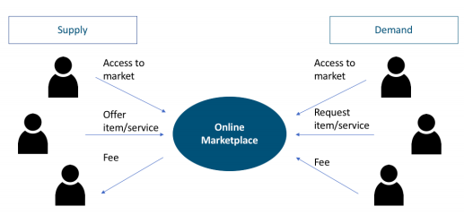
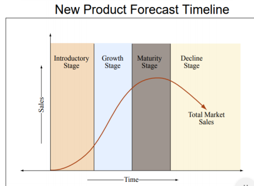

# Purvaanuman

It has been observed that the market present scenario and future projection is not available to MSME for any product. This is one of the cause of sick unit in MSME. Product change or updating will discontinue production of any MSME. Future forecast of market / product will give time to switch over in new product to MSME. Market data bank with future forecast and updating of information can be made available through website, mobile notifications etc.

EVOLUTIONARY APPROACH: This approach is suitable for small scale products as of MSME’s for updating in qualities, price and features of existing products of large scale companies.

REGRESSION ANALYSIS: The different regression correlations are calculated separately for the MSME products and competing large scale organizations. As it will be best for comparison of future forecasting of both products. There will be concepts of dependent and independent variables. The quantity demanded is the dependent variable and income, the price of goods, price of related goods, the price of substitute goods, etc. are independent variables.

